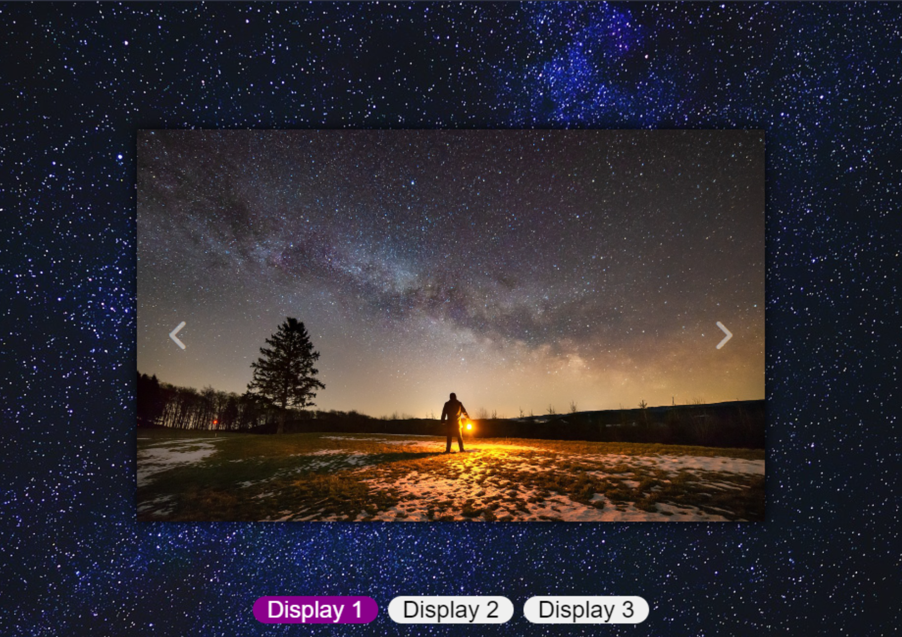

# Slide de Imagens Automático
Projeto que permite passar slides de imagens de forma automática na tela.

## Tecnologias utilizadas
- HTML
- CSS
- JAVASCRIPT
- GIT

## Funcionalidades
- [x] Slide de imagens manual ou automático
- [x] Botões interativos
- [x] Variação de visualização

## Layout

## Demonstração
[Slide de imagens](https://bminority.github.io/Slide/)

## Desenvolvido por
Bruno Coelho [Linkedin](www.linkedin.com/in/bruno-coelho-97b630220)